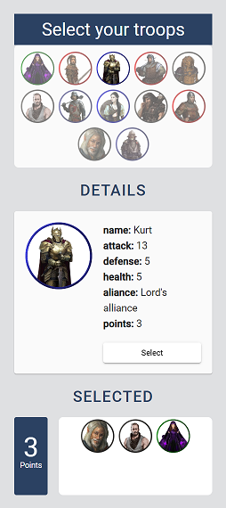

# Dukkha

Small "choose your own adventure" style app, selecting options in this dark fantasy world to reach a final score depending on your decisions. A [DEMO](https://dukkha-e7d89.web.app/) is deployed on Firebase so  it can be played online.



## Features

This application has been developed partially as a front-end development demonstrator and has the following features:

 - Authentication and authorization in the access of private routes
 - Real-time persistence of all user interactions
 - Centralized state and unidirectional data flow
 - Non trivial domain logic
 - Cohesive user interfaces and colors


## Tools

For the development of this application these tools have been used:

- Angular as FE framework.
- Firebase for authentication, hosting and Cloud Firestore as database.
- Angular material as component library and Material Design icons.
- Jasmine/Karma for unit tests.


## Commands

As in a normal Angular CLI project this are the most common commands:

 - Serve

    ```
    Run `ng serve` for a dev server. Navigate to `http://localhost:4200/`.
    ```

- Build
    ```
    Run `ng build` to build the project. The build artifacts will be stored in the `dist/` directory.
    ```

- Test
    ```
    Run `ng test` to execute the unit tests via Karma.
    ```
